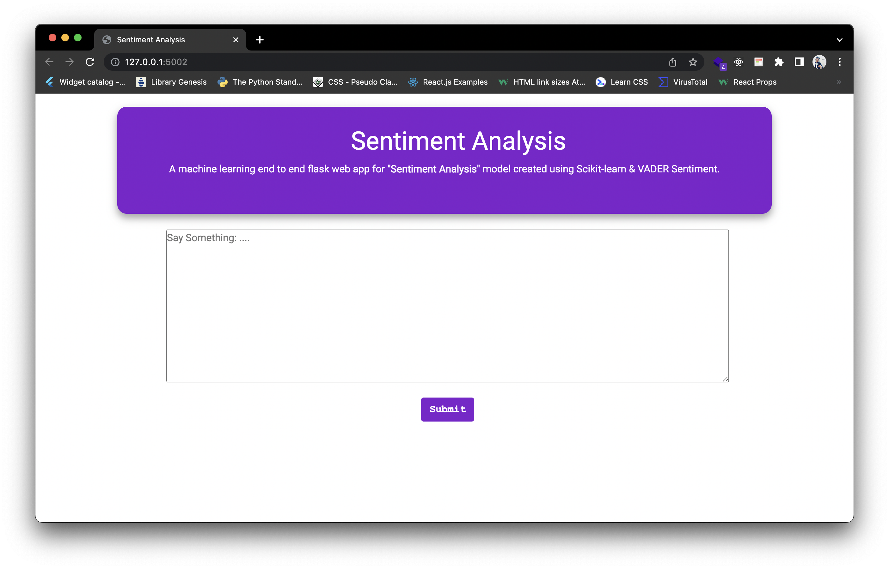
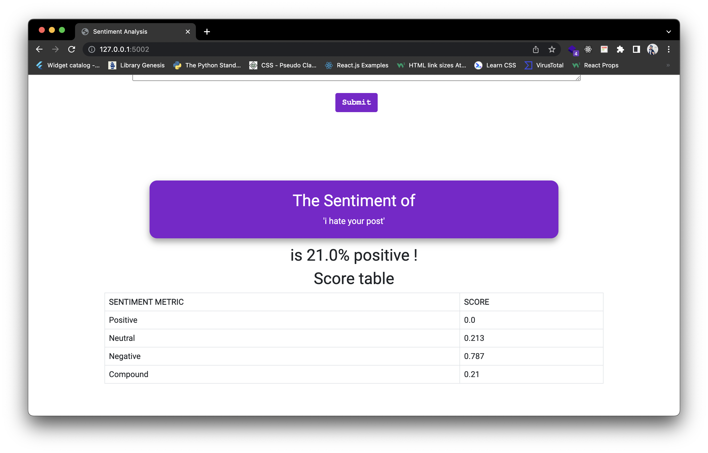

# Sentiment-Analysis using ML in Flask

### Team name: Dark Coders

## Team members

* Vijay Prajapati - vijayprajapati6350@gmail.com
* Om Jadhav - omjadhav963@gmail.com
* Hasnain Sayyed - hasnainsayyed833@gmail.com

## Description

* Because technology is constantly being updated, Social Media serves as a platform for these updates to reach a large audience.
* But as the technology makes solutions it also keeps on creating a new problem so if a comment is being released on a post we cant judge the sentiments of the comments by just reading it sometimes!
* So we have created a solution in the form web app where user just have to copy and paste the comment and the app would give an analysis of the comment.

## Links

* GitHub Repo link: [Link to repository](https://github.com/omjadhav3714/setiment-analysis-python)
* Video Demo link: [Link to demo](https://youtu.be/F6e-NDn0nug)

## Technology stack

Tools and technologies that you learnt and used in the project.

1. Python Flask
2. NLTK
3. HTML, CSS, JS

## Project Setup

* For this project, you will have to install latest version of Pycharm.
* The steps to do so are:

  > Open Pycharm -> Configure the pycharm with python -> click on install button at the top to download all dependency -> click on run.

## Usage

* User have to copy the comment of his/her post.
* User should visit to our website and paste the comment in the box.
* After Clicking on Submit user would be displayed a report of analysis on the screen.

## Future scope

* Connecting to user's social media accounts directly and display analysis of the comments by fetching it from respective posts.

## Screenshots

|  |  |  |  |
| :-------------: | :-------------:  | :-------------:  | :-------------:  |
|     Home Page     |    Positive Comment   |    Negative Comment     |     Neutral comment     |
